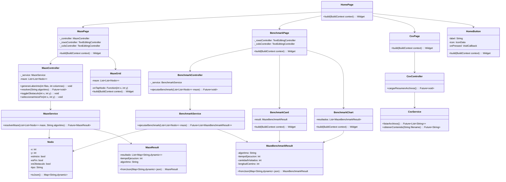

# Proyecto Final - Estructura de Datos

**Universidad Politécnica Salesiana**  
**Carrera:** Computación  
**Materia:** Estructura de Datos - Segundo Interciclo  
**Docente:** Ing. Pablo Torres  
**Autores:**  
- [Cristopher Salinas] - [csalinasz@est.ups.edu.ec]  
- [Juan Jimenez] - [jjimenezc16@est.ups.edu.ec]  

---

##  Objetivo General

Desarrollar una aplicación que implemente distintos algoritmos de búsqueda para encontrar la **ruta óptima** en un laberinto desde un punto de inicio (A) hasta un punto final (B), aplicando **programación dinámica** y **estructuras de datos** eficientes.

---

##  Descripción del Problema

El sistema implementa un solucionador de laberintos que permite:

1. Generar laberintos personalizables en tamaño y configuración
2. Seleccionar entre 5 algoritmos de búsqueda de rutas
3. Visualizar el proceso de solución paso a paso
4. Comparar el rendimiento de los algoritmos
5. Almacenar históricos de ejecución

El laberinto se modela como una matriz donde cada celda puede ser:
- Punto de inicio (A)
- Punto final (B)
- Obstáculo (no transitable)
- Camino libre (transitable)

---

## Marco Teórico

### Algoritmos Implementados

1. **BFS (Breadth-First Search)**
   - Basado en colas (FIFO)
   - Explora todos los nodos en el nivel actual antes de pasar al siguiente
   - Garantiza encontrar el camino más corto en grafos no ponderados
   - Complejidad: O(V+E)

2. **DFS (Depth-First Search)**
   - Basado en pilas (LIFO)
   - Explora ramas completas antes de retroceder
   - No garantiza el camino más corto
   - Complejidad: O(V+E)

3. **Recursivo 2 Direcciones**
   - Movimiento solo hacia derecha y abajo
   - Implementación con recursión simple
   - Eficiente para laberintos con restricciones de movimiento

4. **Recursivo 4 Direcciones**
   - Movimiento en todas direcciones (arriba, abajo, izquierda, derecha)
   - Mayor flexibilidad que el de 2 direcciones
   - Mayor consumo de memoria por la pila de recursión

5. **Backtracking**
   - Técnica de prueba y error
   - Vuelve atrás cuando encuentra caminos sin salida
   - Implementa memoización para optimización

### Estructuras Utilizadas
- **Matrices** para representar el laberinto
- **Colas** para BFS
- **Pilas** implícitas en la recursión
- **Grafos** implícitos en la estructura del laberinto

---

##  Tecnologías Utilizadas

### Backend (Java - Spring Boot)
- **Lenguaje:** Java 21
- **Framework:** Spring Boot 3.5.4
- **Endpoints REST:**
  - `/resolver`: Resuelve laberinto con algoritmo específico
  - `/benchmark`: Ejecuta comparativa de algoritmos
  - `/logs`: Gestión de archivos históricos

### Frontend (Flutter)
- **Framework:** Flutter 3.32.7
- **Gestión de estado:** Provider
- **Visualización:** Custom painters y gráficos interactivos

### Almacenamiento
- Archivos CSV para registro de ejecuciones
- Sistema de logs con timestamp

---

##  Estructura del Proyecto

### Diagrama UML Backend


### Diagrama UML fronted



### Capturas


```
// Implementación BFS en MazeSolver.java

private static MazeResult bfs(Maze maze) {
    List<Nodo> nodos = maze.getNodos();
    int filas = maze.getFilas();
    int columnas = maze.getColumnas();

    // 1. Encontrar nodos de inicio y fin

    Nodo inicio = nodos.stream().filter(Nodo::isEsInicio).findFirst().orElse(null);
    Nodo fin = nodos.stream().filter(Nodo::isEsFin).findFirst().orElse(null);

    // 2. Inicializar estructuras de datos

    boolean[][] visitado = new boolean[filas][columnas];
    Map<Nodo, Nodo> padres = new HashMap<>();
    Queue<Nodo> cola = new LinkedList<>();
    List<Map<String, Object>> resultado = new ArrayList<>();

    // 3. Iniciar BFS desde el nodo inicial

    cola.add(inicio);
    visitado[inicio.getX()][inicio.getY()] = true;
    
    int[][] direcciones = {{-1, 0}, {1, 0}, {0, -1}, {0, 1}}; // Movimientos posibles

    while (!cola.isEmpty()) {
        Nodo actual = cola.poll();
        resultado.add(Map.of("x", actual.getX(), "y", actual.getY(), "tipo", "visitado"));

        if (actual.equals(fin)) break; // Solución encontrada

        // 4. Explorar vecinos

        for (int[] dir : direcciones) {
            int nx = actual.getX() + dir[0];
            int ny = actual.getY() + dir[1];
            
            if (esValido(nodos, nx, ny, filas, columnas, visitado)) {
                Nodo vecino = encontrarNodo(nodos, nx, ny);
                visitado[nx][ny] = true;
                padres.put(vecino, actual);
                cola.add(vecino);
            }
        }
    }

    // 5. Reconstruir camino desde el final

    List<Map<String, Object>> camino = new ArrayList<>();
    Nodo actual = fin;
    while (padres.containsKey(actual)) {
        camino.add(Map.of("x", actual.getX(), "y", actual.getY(), "tipo", "camino"));
        actual = padres.get(actual);
    }
    
    // 6. Preparar resultado final

    camino.add(Map.of("x", inicio.getX(), "y", inicio.getY(), "tipo", "camino"));
    Collections.reverse(camino);
    resultado.addAll(camino);

    return new MazeResult(resultado, 0, "bfs");
}
```

### Explicación:

- Identifica nodos iniciales y finales

- Inicializa estructuras para el algoritmo

- Comienza la exploración desde el nodo inicial

- Explora sistemáticamente todos los vecinos

- Reconstruye el camino desde el final

- Retorna el resultado con el camino solución

##  Conclusiones

###  Estudiante 1 

Durante las pruebas con la interfaz desarrollada en Flutter, noté que el algoritmo BFS fue el más eficiente al momento de encontrar el camino más corto, especialmente en laberintos complejos. La opción de visualizar paso a paso permitió observar cómo BFS expande sus nodos de forma sistemática, lo cual fue muy útil para fines educativos. Sin embargo, en laberintos grandes noté un leve retraso en la visualización, probablemente por la cantidad de nodos visitados que debe procesar. Aun así, para aplicaciones visuales donde se desea claridad en el recorrido, BFS fue el más consistente.

###  Estudiante 2 

Desde el backend, trabajar con distintos algoritmos me permitió entender cómo cada uno responde a estructuras diferentes de laberintos. El enfoque Backtracking fue especialmente útil en escenarios donde existían múltiples caminos erróneos, ya que permite retroceder y corregir. Sin embargo, en laberintos más grandes noté que la profundidad de la recursión puede ser un problema si no se maneja bien. Por otro lado, DFS fue bastante rápido, pero no siempre encuentra el camino más corto. La estructura modular del backend facilitó la integración de estos algoritmos y su uso desde Flutter.
