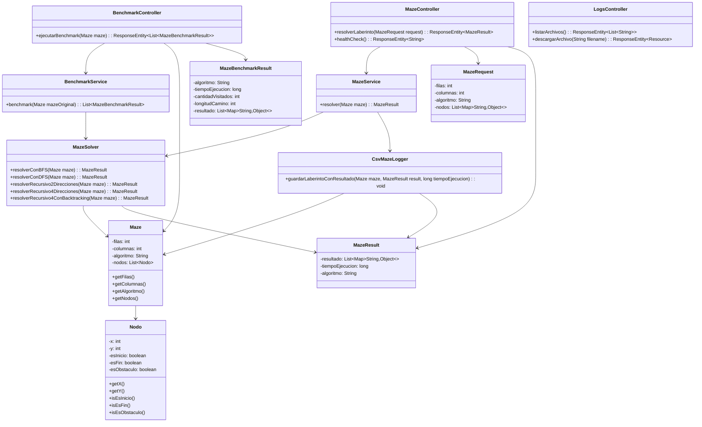

# Proyecto Final - Estructura de Datos

**Universidad Politécnica Salesiana**  
**Carrera:** Computación  
**Materia:** Estructura de Datos - Segundo Interciclo  
**Docente:** Ing. Pablo Torres  
**Autores:**  
- [Nombre Estudiante 1] - [correo1@est.ups.edu.ec]  
- [Nombre Estudiante 2] - [correo2@est.ups.edu.ec]  

---

## 🎯 Objetivo General

Desarrollar una aplicación que implemente distintos algoritmos de búsqueda para encontrar la **ruta óptima** en un laberinto desde un punto de inicio (A) hasta un punto final (B), aplicando **programación dinámica** y **estructuras de datos** eficientes.

---

## 📘 Descripción del Problema

El sistema implementa un solucionador de laberintos que permite:

1. Generar laberintos personalizables en tamaño y configuración
2. Seleccionar entre 5 algoritmos de búsqueda de rutas
3. Visualizar el proceso de solución paso a paso
4. Comparar el rendimiento de los algoritmos
5. Almacenar históricos de ejecución

El laberinto se modela como una matriz donde cada celda puede ser:
- Punto de inicio (A)
- Punto final (B)
- Obstáculo (no transitable)
- Camino libre (transitable)

---

## 🧠 Marco Teórico

### Algoritmos Implementados

1. **BFS (Breadth-First Search)**
   - Basado en colas (FIFO)
   - Explora todos los nodos en el nivel actual antes de pasar al siguiente
   - Garantiza encontrar el camino más corto en grafos no ponderados
   - Complejidad: O(V+E)

2. **DFS (Depth-First Search)**
   - Basado en pilas (LIFO)
   - Explora ramas completas antes de retroceder
   - No garantiza el camino más corto
   - Complejidad: O(V+E)

3. **Recursivo 2 Direcciones**
   - Movimiento solo hacia derecha y abajo
   - Implementación con recursión simple
   - Eficiente para laberintos con restricciones de movimiento

4. **Recursivo 4 Direcciones**
   - Movimiento en todas direcciones (arriba, abajo, izquierda, derecha)
   - Mayor flexibilidad que el de 2 direcciones
   - Mayor consumo de memoria por la pila de recursión

5. **Backtracking**
   - Técnica de prueba y error
   - Vuelve atrás cuando encuentra caminos sin salida
   - Implementa memoización para optimización

### Estructuras Utilizadas
- **Matrices** para representar el laberinto
- **Colas** para BFS
- **Pilas** implícitas en la recursión
- **Grafos** implícitos en la estructura del laberinto

---

## 🧰 Tecnologías Utilizadas

### Backend (Java - Spring Boot)
- **Lenguaje:** Java 11
- **Framework:** Spring Boot 2.7
- **Endpoints REST:**
  - `/resolver`: Resuelve laberinto con algoritmo específico
  - `/benchmark`: Ejecuta comparativa de algoritmos
  - `/logs`: Gestión de archivos históricos

### Frontend (Flutter)
- **Framework:** Flutter 3.0
- **Gestión de estado:** Provider
- **Visualización:** Custom painters y gráficos interactivos

### Almacenamiento
- Archivos CSV para registro de ejecuciones
- Sistema de logs con timestamp

---

## 🧩 Estructura del Proyecto

### Diagrama UML Backend


### Diagrama UML fronted

```mermaid
classDiagram
    %% Páginas
    class MazePage {
        -_controller: MazeController
        -_rowsController: TextEditingController
        -_colsController: TextEditingController
        +build(BuildContext context): Widget
    }

    class BenchmarkPage {
        -_rowsController: TextEditingController
        -_colsController: TextEditingController
        +build(BuildContext context): Widget
    }

    class CsvPage {
        +build(BuildContext context): Widget
    }

    class HomePage {
        +build(BuildContext context): Widget
    }

    %% Controladores
    class MazeController {
        -_service: MazeService
        -maze: List~List~Nodo~~
        +generarLaberinto(int filas, int columnas): void
        +resolver(String algoritmo): Future~void~
        +toggleObstaculo(int x, int y): void
        +seleccionarInicioFin(int x, int y): void
    }

    class BenchmarkController {
        -_service: BenchmarkService
        +ejecutarBenchmark(List~List~Nodo~~ maze): Future~void~
    }

    class CsvController {
        +cargarResumenArchivos(): Future~void~
    }

    %% Servicios
    class MazeService {
        +resolverMaze(List~List~Nodo~~ maze, String algoritmo): Future~MazeResult~
    }

    class BenchmarkService {
        +ejecutarBenchmark(List~List~Nodo~~ maze): Future~List~MazeBenchmarkResult~~
    }

    class CsvService {
        +listarArchivos(): Future~List~String~~
        +obtenerContenido(String filename): Future~String~
    }

    %% Modelos
    class Nodo {
        -x: int
        -y: int
        -esInicio: bool
        -esFin: bool
        -esObstaculo: bool
        -tipo: String
        +toJson(): Map~String,dynamic~
    }

    class MazeResult {
        -resultado: List~Map~String,dynamic~~
        -tiempoEjecucion: int
        -algoritmo: String
        +fromJson(Map~String,dynamic~ json): MazeResult
    }

    class MazeBenchmarkResult {
        -algoritmo: String
        -tiempoEjecucion: int
        -cantidadVisitados: int
        -longitudCamino: int
        +fromJson(Map~String,dynamic~ json): MazeBenchmarkResult
    }

    %% Componentes UI
    class MazeGrid {
        -maze: List~List~Nodo~~
        -onTapNodo: Function(int x, int y)
        +build(BuildContext context): Widget
    }

    class BenchmarkCard {
        -result: MazeBenchmarkResult
        +build(BuildContext context): Widget
    }

    class BenchmarkChart {
        -resultados: List~MazeBenchmarkResult~
        +build(BuildContext context): Widget
    }

    class HomeButton {
        -label: String
        -icon: IconData
        -onPressed: VoidCallback
        +build(BuildContext context): Widget
    }

    %% Relaciones
    MazePage --> MazeController
    BenchmarkPage --> BenchmarkController
    CsvPage --> CsvController
    HomePage --> MazePage
    HomePage --> BenchmarkPage
    HomePage --> CsvPage
    MazeController --> MazeService
    BenchmarkController --> BenchmarkService
    CsvController --> CsvService
    MazeService --> Nodo
    MazeService --> MazeResult
    BenchmarkService --> Nodo
    BenchmarkService --> MazeBenchmarkResult
    MazePage --> MazeGrid
    BenchmarkPage --> BenchmarkCard
    BenchmarkPage --> BenchmarkChart
    HomePage --> HomeButton
    BenchmarkCard --> MazeBenchmarkResult
    BenchmarkChart --> MazeBenchmarkResult